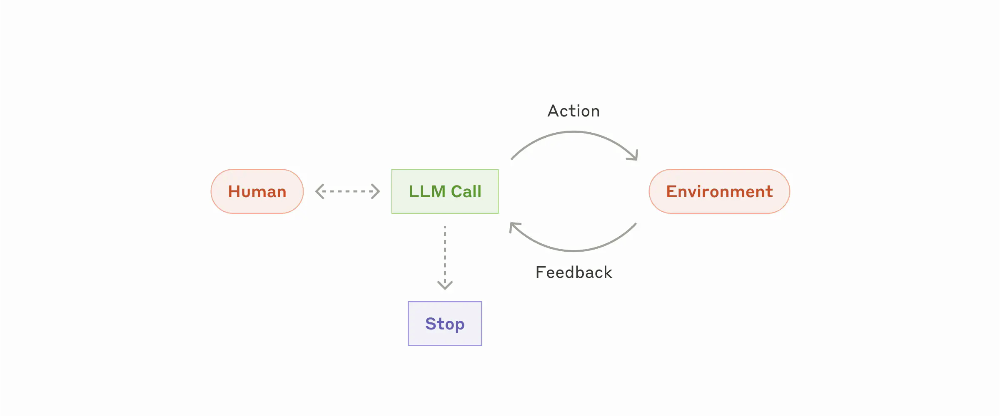

# ODSC, Boston, May 2025

Slides at <https://github.com/pydantic/talks>

## whoami

**Samuel Colvin** — creator of Pydantic

Pydantic:
* Python library for data validation
* Created Pydantic in 2017 — long before Gen AI
* Now downloaded ~350M per month
* Used by all of FAANG
* Used by virtually every GenAI Python library — both provider SDKs and Agent Frameworks

* Became a company (Pydantic Labs), backed by Sequoia in 2023, released:
  * Pydantic Logfire (developer observability)
  * Pydantic AI (agent framework)


## what

"Building AI Applications the Pydantic way"

* Everything is changing
* ...except when it's not: people still want to build
reliable, scalable applications, and that's still hard.

In this talk, we'll use **PydanticAI** & **Pydantic Logfire** to demonstrate:
* How to build typesafe agents — important for production,
  even more important for development
* The power of MCP for autonomous agents
* How evals fit into the picture

* The importance of tracing and observability for AI Applications


## What is an "Agent"?

This has been widely covered, but still seems to be a subject of dispute, so I'll explain what I mean.

From [Building effective agents](https://www.anthropic.com/engineering/building-effective-agents).



From [How We Build Effective Agents: Barry Zhang, Anthropic](https://youtu.be/D7_ipDqhtwk?&t=358)

**Agents are models using tools in a loop**
```py
env = Environment()
tools = Tools(env)
system_prompt = "Goals, constraints, and how to act"

while True:
    action = llm.run(system_prompt + env.state)
    env.state = tools.run(action)
```


## Enough pseudo code, show me a real example

```py {title="simplest_agent.py"}
from datetime import date
from pydantic_ai import Agent
from pydantic import BaseModel


class Person(BaseModel):
    name: str
    dob: date
    city: str


agent = Agent(
    'openai:gpt-4o',
    output_type=Person,
    instructions='Extract information about the person',
)
result = agent.run_sync("Samuel lived in London and was born on Jan 28th '87")
print(repr(result.output))
```

This doesn't look much like a loop, but what if validation fails...

```py title="agent_retry.py"
from datetime import date
from pydantic_ai import Agent
from pydantic import BaseModel, field_validator

import logfire
logfire.configure(service_name='agent-retry')
logfire.instrument_pydantic_ai()

class Person(BaseModel):
    """Definition of an historic person"""
    name: str
    dob: date
    city: str

    @field_validator('dob')
    def validate_dob(cls, v: date) -> date:
        if v >= date(1900, 1, 1):
            raise ValueError('The person must be born in the 19th century')
        return v


agent = Agent(
    'google-vertex:gemini-2.0-flash',
    output_type=Person,
    instructions='Extract information about the person',
)
result = agent.run_sync("Samuel lived in London and was born on Jan 28th '87")
print(repr(result.output))
```


## But don't Agents need tools?

Here we demonstrate tools, dependencies and type safety with a tool used to record memories.

```py {title="memory_tools.py"}
...
agent = Agent(
    'openai:gpt-4o',
    deps_type=Deps,
    instructions='You are a helpful assistant.',
)


@agent.tool
async def record_memory(ctx: RunContext[Deps], value: str) -> str:
    """Use this tool to store information in memory."""
    await ctx.deps.conn.execute(
        'insert into memory(user_id, value) values($1, $2) on conflict do nothing', ctx.deps.user_id, value
    )
    return 'Value added to memory.'


@agent.tool
async def retrieve_memories(ctx: RunContext[Deps]) -> str:
    """Get all memories about the user."""
    rows = await ctx.deps.conn.fetch('select value from memory where user_id = $1', ctx.deps.user_id)
    return '\n'.join(row[0] for row in rows)
...
```

We can also achieve memory by persisting message history:

```py {title="memory_messages.py"}
async def run_agent(prompt: str, user_id: int):
    async with db() as conn:
        with logfire.span('retrieve messages'):
            messages: list[ModelMessage] = []
            for row in await conn.fetch('SELECT messages FROM messages WHERE user_id = $1 order by ts', user_id):
                messages += ModelMessagesTypeAdapter.validate_json(row[0])

        result = await agent.run(prompt, message_history=messages)
        print(result.output)

        with logfire.span('record messages'):
            msgs = result.new_messages_json().decode()
            await conn.execute('INSERT INTO messages(user_id, messages) VALUES($1, $2)', user_id, msgs)
```


## MCP

Tools, are great. Model Context Protocol gives us lots of tools and LOTS more.

```py {title="mcp-run-python"}
import asyncio

from pydantic_ai import Agent
from pydantic_ai.mcp import MCPServerStdio

import logfire
logfire.configure(service_name='mcp-run-python')
logfire.instrument_pydantic_ai()
logfire.instrument_mcp()

server = MCPServerStdio(
    'deno',
    args=[
        'run',
        '-N',
        '-R=node_modules',
        '-W=node_modules',
        '--node-modules-dir=auto',
        'jsr:@pydantic/mcp-run-python',
        'stdio',
    ]
)
agent = Agent('openai:gpt-4o', mcp_servers=[server])


async def main():
    async with agent.run_mcp_servers():
        result = await agent.run('How many days between 2000-01-01 and 2025-03-18?')
    print(result.output)

if __name__ == '__main__':
    asyncio.run(main())
```

But there are lots of powerful MCP servers, including browser control:

```py {title="browser_mcp.py"}
...

async def main():
    async with agent.run_mcp_servers():
        result = await agent.run(
            'get the most recent blog post from pydantic.dev '
            'which should contain multiple announcements, '
            'summaries those annoucements as a list.'
        )
    print(result.output)

...
```

Or using a graph...

```py {title="browser_mcp_graph.py"}
...

graph = Graph(nodes=[FindBlog, FindLatestPosts, SummariesContent])

async def main():
    async with browser_agent.run_mcp_servers():
        result = await graph.run(FindBlog(url='pydantic.dev'))
        print(result.output)

...
```


## Evals

Let's switch to evals, time to dive into some code.


## PydanticAI is unfinished, what's next?

* Structured outputs without tools
* Lots (!!) of documentation improvements
* end an agent run from within a tool
* MCP sampling — client support
* MCP sampling — server support
* allow more control of how MCP tools are registered with the model, and run
* `mcp-run-python` — calling back to the client/host
* Graph changes

Most importantly:

* **We need stability — planning to release V1 in June**
