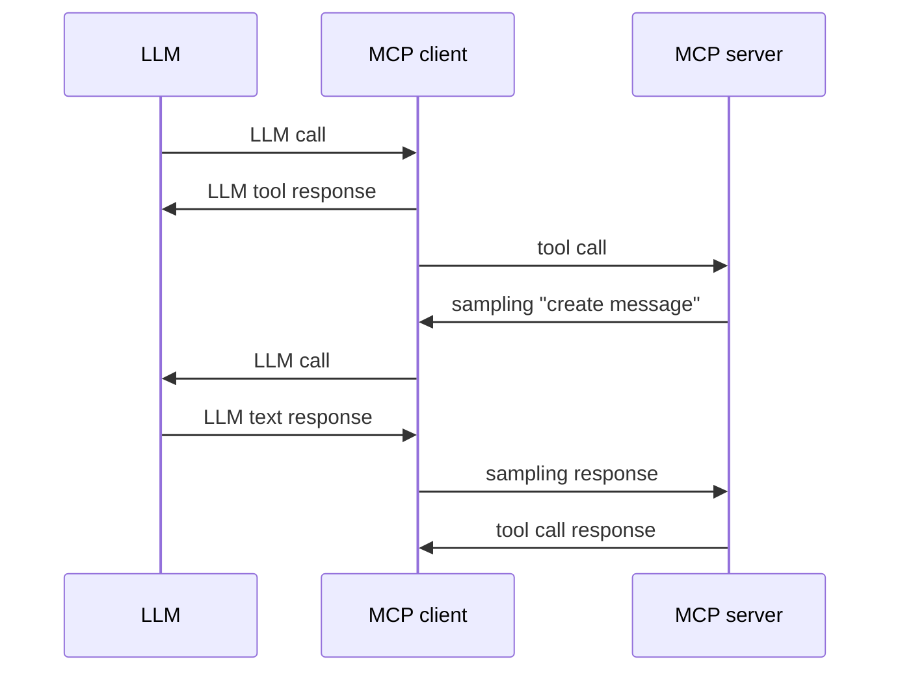

# AI Engineer, San Fransico, June 2025

Slides at <https://github.com/pydantic/talks>

## whoami

**Samuel Colvin** — creator of Pydantic

Pydantic:
* Python library for data validation
* Created Pydantic in 2017 — long before Gen AI
* Now downloaded ~350M per month
* Used by all of FAANG
* Used by virtually every GenAI Python library — both provider SDKs and Agent Frameworks

Became a company (Pydantic Labs), backed by Sequoia in 2023, released:
* Pydantic Logfire (developer observability)
* Pydantic AI (agent framework)

**Come to our booth for Logfire demo, t-shirts, etc.**

## what

**MCP is all you need**

* Inspired by Jason Liu's talk "Pydantic is all you need"
* Same idea that lots of people are over complicating things
* Same unrealistic title — no one is seriously claiming MCP can do everything

What I am saying is:

**MCP can do a lot of fancy multi-agent communication.**

# how

MCP was not (primarily) designed for multi-agent communication.

So two of its primatives (prompts and resources) probably aren't necessary.

But tool calling, (the third primative) absolutely is!

And tools are lot more complex you might at first assume:
* dynamic tools
* logging
* sampling
* tracing

 TODO!

# sampling

Give servers the ability to make requests to LLMs via the client.

(Powerful feature of MCP, but not widely supported*)

# Example

TODO Library research tool.
* connects to pypi MCP server with natural language query
* MCP server uses sampling to convert query into SQL, runs sql.
