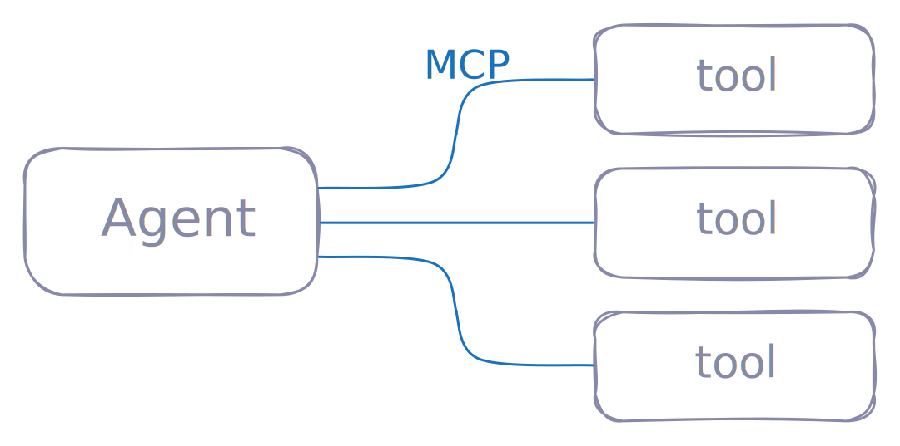

# MCP is all you need

### AI Engineer, San Fransico, June 2025

Slides at [github.com/pydantic/talks](https://github.com/pydantic/talks).

---

## whoami

**Samuel Colvin** — creator of Pydantic

Pydantic:
* Python library for data validation
* Created Pydantic in 2017 — long before Gen AI
* Now downloaded ~350M per month
* Used by all of FAANG
* Used by virtually every GenAI Python library — both provider SDKs and Agent Frameworks

Became a company (Pydantic Labs), backed by Sequoia in 2023, released:
* Pydantic Logfire (developer observability)
* Pydantic AI (agent framework)

**Come to our booth for Logfire demo, t-shirts, etc.**

_(I'm also a co-maintainer of the MCP python SDK)_

---

# what

**MCP is all you need**

* Inspired by Jason Liu's talk "Pydantic is all you need" and "Pydantic is still all you need"
* Same idea: that lots of people are over complicating things
* Same unrealistic title — no one is seriously claiming MCP can do everything

What I am saying is:

**MCP can do a lot of multi-agent communications.**

---

# how

MCP was not (primarily) designed for multi-agent communication.

So two of its primatives (prompts and resources) probably aren't necessary.

But tool calling, (the third primative) absolutely is!

And tools are lot more complex than you might at first assume:
* dynamic tools
* logging
* sampling
* tracing

---

# MCP for multi-agent communication

The way most people describe it:



---

# MCP for multi-agent communication

But what if servers can be clients:


... but there's a problem.

---

# sampling

Give MCP servers the ability to make requests to LLMs via the client.

(Powerful feature of MCP, but not widely supported*)


---

# Example

Library research tool.
* connects to pypi MCP server with natural language query
* MCP server uses sampling to convert query into SQL, runs sql.

```py
from pydantic_ai import Agent
from pydantic_ai.mcp import MCPServerStdio

...

server = MCPServerStdio(command='uv', args=['run', 'pypi_mcp_server.py'])
libs_agent = Agent(
    'openai:gpt-4o',
    mcp_servers=[server],
    instructions='your job is to help the user research software libraries and packages using the tools provided',
)

async def main():
    async with libs_agent.run_mcp_servers():
        result = await libs_agent.run('How many times has pydantic been downloaded this year')
    print(result.output)
```

---

# Thank you

Slides at [github.com/pydantic/talks](https://github.com/pydantic/talks).

I'm at the Pydantic booth, if you have any questions, com and say hi.
